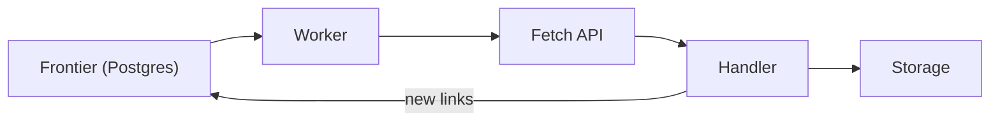
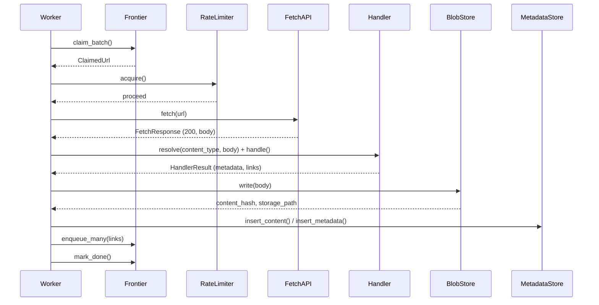
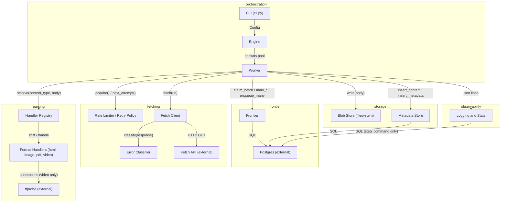

# Architecture

## 1. The mental model

The crawler pulls URLs from a Postgres-backed frontier, fetches each one through an external API, sniffs and stores what comes back, and feeds any links it finds back into the frontier.

A worker claims one pending URL from the frontier and fetches it through the external Fetch API — a black box that can be slow, rate-limited, or just wrong. A handler, chosen by looking at the response body's own bytes rather than trusting any header, turns that response into a stored file plus metadata. Any links the handler finds go back into the frontier as new pending rows. That loop runs on `max_concurrency` workers at once and stops when nothing is left pending — everything else in this document is detail on top of that one cycle.

## 2. Where the code lives

| Box in diagram | Start reading here | What it does |
|---|---|---|
| Frontier (Postgres) | `src/crawler/store/frontier.py` | Claims, updates, and enqueues URLs. The only source of truth for what's been crawled, what's pending, and what's currently leased to a worker. |
| Worker | `src/crawler/worker.py` | Runs one URL through its whole life: fetch, route to a handler, persist, enqueue links, log the outcome. |
| Fetch API | `src/crawler/fetch/client.py` | The only place that talks to the external fetch service over HTTP. Everything else deals in `FetchResult`, not raw responses. |
| Handler | `src/crawler/handlers/base.py` | Picks which handler (`html.py`, `image.py`, `pdf.py`, `video.py`, ...) matches a body's actual bytes, and hands off to it. |
| Storage | `src/crawler/store/blobs.py` | Writes the fetched body to disk, named by its content hash (`store/metadata.py` records it in Postgres alongside it). |

If you only read one table in this document, read this one — it's the box-to-file map for everything above.

## 3. Life of a single URL (happy path)

**Legend:** solid arrows are calls, dashed arrows are returns. This is the path where everything works — the fetch succeeds, the body matches a handler, nothing collides. Retries, lease expiry, and every failure branch are real and common, but they're prose in [section 5](#5-things-that-will-surprise-you), not on this diagram — putting them here would turn the one path worth memorizing into a flowchart nobody can hold in their head.

| Step | File |
|---|---|
| `claim_batch()` | `src/crawler/store/frontier.py` |
| `acquire()` | `src/crawler/fetch/rate_limiter.py` |
| `fetch()` | `src/crawler/fetch/client.py` |
| `resolve()` / `handle()` | `src/crawler/handlers/base.py`, `handlers/html.py` (etc.) |
| `write()` | `src/crawler/store/blobs.py` |
| `insert_content()` / `insert_metadata()` | `src/crawler/store/metadata.py` |
| `enqueue_many()` / `mark_done()` | `src/crawler/store/frontier.py` |

All of this happens inside `worker.py`'s `process_one()`.

## 4. Reading order

1. **`src/crawler/cli.py`** — the entry point. Two commands, `crawl` and `stats`; shows how a `Config` gets built before anything else runs.
2. **`src/crawler/engine.py`** — `run()` is what `crawl` calls. Shows the worker pool getting spawned, and the three support tasks (lease recovery, drain detection, progress logging) that keep it alive.
3. **`src/crawler/worker.py`** — `worker.run()` is what `engine.py` spawns one of per slot in `max_concurrency`. `process_one()` is the real unit of work — read it next to the sequence diagram in section 3.
4. **`src/crawler/store/frontier.py`** — every function `worker.py` calls to touch a URL's row (`claim_batch`, `mark_done`, `mark_failed`, `enqueue_many`). This is where "Postgres is the queue" stops being an abstract claim and becomes a `SELECT ... FOR UPDATE SKIP LOCKED`.
5. **`src/crawler/handlers/base.py`**, then skim **`handlers/html.py`** — how a fetched body becomes a typed, stored thing. `resolve()` is the last decision before anything gets written.

Read these in order and you've followed the actual flow of control from process start to one URL landing in storage.

## 5. Things that will surprise you

**Postgres is the queue.** There's no Redis, no RabbitMQ, no Kafka, and that's deliberate, not missing. `claim_batch()` uses `SELECT ... FOR UPDATE SKIP LOCKED` so multiple workers can each grab a different pending row without blocking each other or double-claiming one. A broker alongside Postgres would mean two writes for one fact — enqueue in the broker, record in the database — and a crash between those two writes either loses a URL or repeats it. Keeping frontier state in the same database as everything else removes that failure mode outright. The cost is that claiming a URL is a real `UPDATE`, not a lightweight dequeue, and that's a trade this project makes on purpose.

**Content type is decided by magic bytes, never by the `Content-Type` header or the URL.** `handlers/base.py`'s `resolve()` treats the header as a hint about which handler to *try first* — every handler's `sniff()` (a check against the body's own leading bytes, like the `ftyp` box for MP4 or the RIFF+WEBP fourCC for WebP) gets the final say regardless. This exists because the fetch API's headers can lie: a response can claim `image/png` and ship something else entirely, and the crawler is built to not trust that claim.

**The fetch API is an unreliable black box by design, and most of `fetch/` exists because of it.** It's one `GET /fetch?url=...` that can return a 429, a 500, or different bytes for the same URL on different attempts (see `fetch/client.py`). `fetch/retry.py`'s jittered backoff and `fetch/rate_limiter.py`'s shared AIMD token bucket aren't optional hardening bolted on afterward — there is no "normal" fetch path that skips them, because no single fetch is guaranteed to just work.

**Terminal writes are fenced by `lease_token`, and skipping that fence would silently corrupt results.** When `claim_batch()` hands a worker a URL, it also mints a fresh, random `lease_token` for that claim. Every write that ends a URL's turn — `mark_done`, `mark_failed`, `mark_skipped`, `release` — is scoped to `WHERE lease_token = $2`. If a worker's lease expires while it's still mid-fetch (a slow response, a pause), `recover_expired_leases` hands that row to a new worker with a *new* token. Without the fencing, the original worker would eventually finish its stale fetch and overwrite whatever the new worker already wrote — silently losing the second worker's result with no error anywhere. With it, the stale write matches zero rows, gets logged as a lost race, and changes nothing.

**Off-host assets get fetched; off-host pages don't.** An `<a href>` to another domain is discovered but never enqueued — that's what keeps the crawl bounded to one site. But an ``, `<video>`, `<source>`, or `<embed>` pointing off-host *is* fetched anyway (`DiscoveredLink.is_asset=True` skips the scope check in `worker.py`). The reasoning: an image or a video is a leaf. Nothing gets parsed out of it that could grow the frontier, so the host restriction — which exists specifically to keep the frontier bounded — has nothing to protect there.

**A redirect is a permanent failure, not something the crawler follows.** `errors.classify()` maps any `3xx` straight to `PERMANENT_FAILURE`, with the `Location` header recorded in the error detail and never fetched. This looks like a missing feature until you check the fetch API's own documented status set — `200/404/403/429/500`, nothing else — so a `3xx` is already off-contract, and it's treated as a deterministic dead end rather than something worth chasing.

**`urls.attempts` only ever moves in one place.** `claim_batch()`'s own `UPDATE` is the only statement in the codebase that increments it — not `mark_failed`, not `release`, not `recover_expired_leases`. A URL whose lease silently expired and got recovered costs exactly one attempt no matter how many times that happens, so the give-up decision in `fetch/retry.py` is counting genuine tries, not claim-and-abandon cycles.

## 6. Full component map

*Reference material — not required reading. This is every module and every external dependency, for when you need to find something specific rather than build the mental model.*

**Legend:** subgraphs group modules by architectural layer, not by file location. `PG` (Postgres) and `FA` (Fetch API) are external systems the crawler talks to but doesn't own; `FFP` (ffprobe) is an optional external subprocess, used only by the video handler when it's present on `PATH`.

| Component | Responsibility | Key files | Input → Output | Talks to (mechanism) |
|---|---|---|---|---|
| CLI | Parses `crawl <seed>` / `stats [--since]`, builds `Config`, runs the async entry point | `src/crawler/cli.py:78` (`main`), `:95-98` (crawl), `:62-70` (`_run_stats`) | CLI args → process exit code (stdout report for `stats`) | Calls `engine.run()` (function call, in-process); calls `store.db`/`store.stats` (function call) |
| Engine | Seeds the frontier, runs `max_concurrency` workers plus 3 support tasks (lease supervisor, drain watcher, progress logger), handles SIGINT/SIGTERM, coordinates graceful shutdown | `src/crawler/engine.py:207` (`run`), `:41` (`_supervise`), `:69` (`_watch_drain`), `:91` (`_progress`), `:115` (`_drain`) | `Config` → process exit code (0/1) + `"crawl stopped"` log line | Postgres via `store.db`/`store.frontier` (asyncpg, function calls); spawns `worker.run()` tasks (in-process asyncio, no queue) |
| Worker | Claims one URL at a time, rate-limits, fetches, routes to a handler, persists, enqueues discovered links, logs one terminal outcome per URL | `src/crawler/worker.py:232` (`run`), `:186` (`process_one`), `:54` (`_persist_success`) | `ClaimedUrl` → DB writes (content/metadata/links/status) + one structured log line | `FetchClient` (function call), `store.frontier`/`store.metadata`/`store.blobs` (function call → Postgres/filesystem), `RateLimiter` (function call) |
| FetchClient | The only thing that talks to the external fetch API; streams and caps the response, decodes the JSON/base64 envelope | `src/crawler/fetch/client.py:61` (class), `:84` (`fetch`), `:36` (`_read_capped`) | `url, prev_etag` → `FetchResult` | External fetch API over HTTP (`aiohttp.ClientSession.get`, `GET {fetch_api_url}?url=...`) — a black-box service, stood in for locally by `tests/fake_api` |
| RateLimiter | One shared AIMD token bucket gating fetch calls | `src/crawler/fetch/rate_limiter.py:13` (class), `:59` (`acquire`), `:72` (`report`) | `acquire()` blocks; `report(throttled, retry_after)` adjusts rate | In-process only, shared across worker tasks (asyncio lock) — no external system |
| Retry policy | Pure function: decides retry timing / give-up from an outcome + attempt count + headers | `src/crawler/fetch/retry.py:27` (`next_attempt`) | `(outcome, attempt_no, headers, now, config)` → `GiveUp \| RetryAt` | None — pure function, called by `worker.py` |
| Error classifier | Maps a `FetchResponse`/exception onto the closed `Outcome`/`ErrorKind` set; the only place a status code is read | `src/crawler/errors.py:50` (`classify`), `:100,111,123,140,147` (`classify_*` variants) | `FetchResponse` or exception → `Classification` | None — pure function |
| Models | Shared wire type (`FetchResponse`) and measured type (`FetchResult`), header helpers | `src/crawler/models.py:70,83` (dataclasses), `:22` (`find_header`), `:38` (`parse_retry_after`) | n/a (data + pure helpers) | None |
| URL tools | Normalization (scheme/host casing, `../`, percent-encoding) and host-scope check | `src/crawler/url_tools.py:42` (`normalize`), `:81` (`in_scope`) | raw URL → normalized URL; `(url, seed_host)` → bool | None — pure |
| DB pool / migrations | Creates the asyncpg pool; applies `migrations/*.sql` under an advisory lock | `src/crawler/store/db.py:30` (`create_pool`), `:34` (`run_migrations`) | `Config` → `asyncpg.Pool`; migration files → applied schema | Postgres (asyncpg, SQL) |
| Frontier | All frontier state transitions: atomic claim (`SKIP LOCKED`), terminal writes fenced by `lease_token`, lease recovery, drain check, link enqueue | `src/crawler/store/frontier.py:69` (`claim_batch`), `:126` (`recover_expired_leases`), `:148` (`crawl_complete`), `:172` (`mark_done`), `:283` (`mark_failed`), `:366` (`enqueue_many`) | `conn` + args → row updates | Postgres (asyncpg, raw SQL) — called by `engine.py` and `worker.py` |
| Blob store | Writes a fetched body to `output_dir/<type>/`, named by content hash + URL slug | `src/crawler/store/blobs.py:22` (`write`) | `(output_dir, directory, extension, url, body)` → `(content_hash, storage_path)` | Local filesystem (or the `crawl-output` Docker volume) — no DB access |
| Metadata store | Inserts `contents` and `content_metadata` rows, keyed by content hash | `src/crawler/store/metadata.py:12` (`insert_content`), `:44` (`insert_metadata`) | `(content_hash, ...)` → DB row | Postgres (asyncpg) |
| Stats | Read-only aggregate queries for `crawler stats`; not called by the live crawl | `src/crawler/store/stats.py:26` (`gather`) | `conn, since` → `Stats` | Postgres (asyncpg) |
| Handler registry | Routes a `(content_type hint, body)` pair to the matching handler by magic-byte sniff | `src/crawler/handlers/base.py:63` (`register`), `:75` (`resolve`) | `(content_type, body)` → `Handler \| None` | None — in-process registry |
| HTML handler | Parses title, `a[href]` links, and `img/video/source/embed` asset URLs | `src/crawler/handlers/html.py:33` (class), `:43` (`handle`) | HTML bytes → `HandlerResult{title, link_count}` + `DiscoveredLink[]` | selectolax (in-process parsing library) |
| Raster image handlers (PNG/JPEG/GIF/WebP) | Sniff by format-specific magic bytes, extract width/height/size via Pillow | `handlers/image.py:20` (PNG), `jpeg.py:18` (JPEG SOI), `gif.py:19` (GIF87a/89a), `webp.py:18` (RIFF+WEBP), shared `handlers/_raster.py:13` | image bytes → `HandlerResult{width,height,file_size}` | Pillow (in-process) |
| PDF handler | Sniffs `%PDF-`, extracts page count + title via pypdf | `src/crawler/handlers/pdf.py:15,21,24` | PDF bytes → `HandlerResult{page_count,title}` | pypdf (in-process) |
| Video handler | Sniffs `ftyp` box + MP4 brand, shells to `ffprobe` for duration | `src/crawler/handlers/video.py:72` (class), `:27` (`_read_duration_seconds`) | MP4 bytes → `HandlerResult{file_size,duration_seconds,...}` | `ffprobe` subprocess via a temp file (opportunistic — absence is handled, not fatal) |
| Config | Loads all runtime settings from env vars / `.env` | `src/crawler/config.py:8` | env → `Config` | None |
| Logging | JSON-lines structured logging to stdout with contextvar-bound fields | `src/crawler/logging.py:39` (`configure_logging`), `:51` (`bind`) | log calls → JSON line on stdout | stdout only — no log aggregator/metrics stack |
| asyncio_util | Cancellable, clock-injectable "wait for event or timeout" helper | `src/crawler/asyncio_util.py:9` (`wait`) | shared by `engine.py`'s support loops and `worker.py`'s poll loop | None |

**External dependencies:**

| Dependency | Role |
|---|---|
| Postgres | Frontier, content dedup, metadata, discovery graph — the only source of truth (no broker) |
| Fetch API (external HTTP service) | Every fetch goes through it; unreliable/rate-limited by design |
| `tests/fake_api` | Test double for the fetch API contract, used in local development and `docker compose up` — not the real service |
| Local filesystem / `crawl-output` volume | Blob storage for downloaded bodies |
| `ffprobe` (optional subprocess) | Reads video duration; its absence is handled, not fatal |
| Docker Compose | Orchestrates `db`, `fake-api`, `crawler` containers |

**Confirmed absent, not just unlisted:** no message broker/queue, no cache, no cron/scheduler (periodic work — lease recovery, drain check, progress logging — runs as in-process `asyncio` loops inside `engine.py`), no headless browser (HTML is parsed statically, no JS execution).
